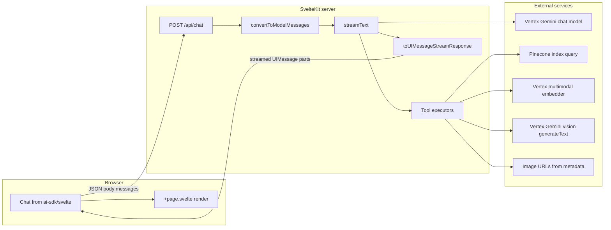

# Chat experience reproduction guide

This document describes how the **sveltekit-agent-demo** application implements a streaming AI chat with optional **document Q&A**, **Pinecone** vector retrieval, **Google Vertex** embeddings and vision, **tool calling**, **reasoning / thinking** display, and **bounding-box highlights** on page images. Another engineering team or AI agent can use it to reproduce the same behavior in a different codebase.

**Authentication is not covered.** This repository does not implement login, sessions, or API protection for `/api/chat`. If you port the design, add your own auth at the edge or in SvelteKit hooks as needed.

**Demo UI caveat:** Example prompt chips in [src/routes/+page.svelte](src/routes/+page.svelte) mention weather queries, but the registered agent tools in [src/lib/agent.ts](src/lib/agent.ts) are only `answerFromImages`, `calculator`, and `unitConverter`. There is no weather tool; those examples will not invoke a weather API.

---

## Table of contents

1. [End-to-end architecture](#1-end-to-end-architecture)
2. [Dependencies](#2-dependencies)
3. [Environment variables](#3-environment-variables)
4. [Server: chat API route](#4-server-chat-api-route)
5. [Server: chat agent configuration](#5-server-chat-agent-configuration)
6. [Server: SvelteKit tool adapter and config](#6-server-sveltekit-tool-adapter-and-config)
7. [Document retrieval and vision pipeline](#7-document-retrieval-and-vision-pipeline)
8. [Pinecone queries](#8-pinecone-queries)
9. [Bounding boxes and highlights](#9-bounding-boxes-and-highlights)
10. [AI agent tools (Vercel AI SDK)](#10-ai-agent-tools-vercel-ai-sdk)
11. [Client: UI, streaming, and perceived performance](#11-client-ui-streaming-and-perceived-performance)
12. [Client: how agent thinking is shown](#12-client-how-agent-thinking-is-shown)
13. [Client: message parts, tools, sources, highlights](#13-client-message-parts-tools-sources-highlights)
14. [Markdown rendering](#14-markdown-rendering)
15. [Observability and debug logging](#15-observability-and-debug-logging)
16. [Reproduction checklist](#16-reproduction-checklist)
17. [Appendix: TypeScript classes, types, and interfaces](#appendix-typescript-classes-types-and-interfaces)

---

## 1. End-to-end architecture

The browser uses `@ai-sdk/svelte` `Chat`, which by default sends the conversation to **`POST /api/chat`**. The SvelteKit handler runs Vercel AI SDK `streamText` against Vertex Gemini, optionally executes tools over multiple steps, and returns a **UI message stream** consumed by `Chat` to update `UIMessage` parts incrementally.



**Request body:** JSON with `messages` as an array of `UIMessage` objects (same shape the AI SDK expects on the client).

**Key server files:**

- [src/routes/api/chat/+server.ts](src/routes/api/chat/+server.ts) — HTTP handler, `streamText`, stream response.
- [src/lib/agent.ts](src/lib/agent.ts) — model instance, system prompt, `agentTools` object.
- [src/lib/tools.ts](src/lib/tools.ts) — builds `AgentToolsConfig` from env, logger, exports tool instances for `agent.ts` (re-exports from agent-tools).

---

## 2. Dependencies

Pinned intent from [package.json](package.json) (exact versions may drift with lockfile):

| Package | Role |
|---------|------|
| `ai` (^6) | `streamText`, `generateText`, `tool`, `convertToModelMessages`, `stepCountIs`, `UIMessage`, streaming helpers |
| `@ai-sdk/svelte` (^4) | `Chat` client, binds to `/api/chat` by default |
| `@ai-sdk/google-vertex` (^4) | `createVertex` for Gemini on Vertex |
| `@pinecone-database/pinecone` (^7) | `Pinecone` client, `index().namespace().query()` |
| `@google-cloud/aiplatform` (^6) | `PredictionServiceClient` for multimodal **text** embedding |
| `zod` (^3) | Tool `inputSchema` definitions |
| `marked` (^18) | Markdown to HTML (GFM) on the client |
| `isomorphic-dompurify` (^3) | Sanitize HTML before `{@html}` |
| `@sveltejs/kit` (^2), `svelte` (^5), `vite` (^6) | App framework and bundler |

---

## 3. Environment variables

### Required for document + Pinecone features

| Variable | Used in | Purpose |
|----------|---------|---------|
| `GOOGLE_PROJECT_ID` | [src/lib/agent.ts](src/lib/agent.ts), [src/lib/tools.ts](src/lib/tools.ts) | Vertex project; throws at module load if missing in agent |
| `PINECONE_API_KEY` | [src/lib/tools.ts](src/lib/tools.ts) → `AgentToolsConfig` | Pinecone API key; validated in `assertAgentToolsConfig` |
| `GOOGLE_APPLICATION_CREDENTIALS` | [src/lib/agent-tools/google-credentials.ts](src/lib/agent-tools/google-credentials.ts) | Service account JSON path for Vertex and aiplatform client |

Relative `GOOGLE_APPLICATION_CREDENTIALS` paths are resolved once against `credentialsResolveCwd` (default `process.cwd()`), and `process.env.GOOGLE_APPLICATION_CREDENTIALS` is rewritten to an absolute path.

### Optional

| Variable | Default / behavior |
|----------|-------------------|
| `GOOGLE_LOCATION` or `GOOGLE_LOCATION_REGION` | Empty or `global` → normalized to `us-central1` (see [src/lib/agent.ts](src/lib/agent.ts) and `normalizeGoogleVertexLocation` in [src/lib/agent-tools/google-credentials.ts](src/lib/agent-tools/google-credentials.ts)) |
| `PINECONE_INDEX_NAME` or `PINECONE_INDEX` | `pdf-image-upsert` |
| `PINECONE_NAMESPACE` | `AAA_UPSERT_TEST` |
| `PINECONE_TOP_K` | `3` (must be finite and &gt; 0) |
| `GEMINI_MODEL` | `gemini-2.5-flash` — used as **vision** model inside tools ([src/lib/tools.ts](src/lib/tools.ts)) |
| `AGENT_MODEL` | `gemini-2.5-flash` — **chat** model ([src/lib/agent.ts](src/lib/agent.ts)) |
| `AGENT_FEEDBACK` | If set to `false` (case-insensitive), `ConsoleAgentToolsLogger` suppresses `info` logs |
| `AGENT_VERBOSE_RETRIEVAL` | If `true`, full Pinecone tool result JSON is printed to stderr |
| `AgentToolsConfig.multimodalEmbeddingModelId` | Not set from env in this repo; default embedder model is `multimodalembedding@001` in code |

---

## 4. Server: chat API route

**File:** [src/routes/api/chat/+server.ts](src/routes/api/chat/+server.ts)

### Request parsing

- `POST` only (export `POST`).
- `await request.json()`; expects `body.messages` to be an array. On invalid JSON or missing array, responds `400` with `{ error: 'Invalid JSON body' }`.

### Abort propagation

- An `AbortController` is created; `request.signal`’s `abort` event calls `abortController.abort()`.
- The same `abortSignal` is passed to `streamText`, so disconnecting the client can abort generation.

### Message conversion

```ts
const modelMessages = await convertToModelMessages(messages, {
  tools: agentTools,
  ignoreIncompleteToolCalls: true
});
```

`ignoreIncompleteToolCalls: true` avoids replaying tool calls that never finished in a prior stream (important for resilient chat history).

### Streaming generation

```ts
const result = streamText({
  model: agentModel,
  system: agentSystem,
  messages: modelMessages,
  tools: agentTools,
  stopWhen: stepCountIs(8),
  abortSignal: abortController.signal,
  onStepFinish: …,
  onFinish: …
});
```

- **`stopWhen: stepCountIs(8)`** caps multi-step tool loops at eight steps.
- **`onStepFinish` / `onFinish`** only feed a local `debugLog` helper (see [Observability](#15-observability-and-debug-logging)).

### Response format

```ts
return result.toUIMessageStreamResponse({
  originalMessages: messages,
  sendReasoning: true,
  onFinish: …
});
```

- **`originalMessages`** lets the SDK merge streamed updates with the client’s prior messages.
- **`sendReasoning: true`** exposes model **reasoning** as separate UI message parts (`type: 'reasoning'`), distinct from the custom `<thinking>` tags in assistant text (see [§12](#12-client-how-agent-thinking-is-shown)).

---

## 5. Server: chat agent configuration

**File:** [src/lib/agent.ts](src/lib/agent.ts)

### Model

- `createVertex({ project: GOOGLE_PROJECT_ID, location: LOCATION })` then `vertex(MODEL)`.
- `MODEL = process.env.AGENT_MODEL?.trim() || 'gemini-2.5-flash'`.
- `GOOGLE_PROJECT_ID` comes from `$env/static/private` and is **required** at import time.

### System prompt (behavioral contract)

The system string instructs the model to:

- Use **`answerFromImages`** for document Q&A and **not** call retrieval tools separately for that case.
- Use calculator / unit tools when needed.
- Explain tool results in natural language and include a short **sources** list with page numbers, image URLs, and bounding boxes when using document tools.
- Before tools or final answers, emit step-by-step reasoning inside **`<thinking>...</thinking>`** tags for the UI to extract (concise).

### Tools exposed to `streamText`

```ts
export const agentTools = {
  answerFromImages: answerFromImagesTool,
  calculator: calculatorTool,
  unitConverter: unitConverterTool
} satisfies ToolSet;
```

**Not registered on the chat agent:** `pineconeQueryTool` is still constructed inside [src/lib/agent-tools/vercel-ai-agent-tools.ts](src/lib/agent-tools/vercel-ai-agent-tools.ts) and exported from [src/lib/tools.ts](src/lib/tools.ts), but **it is not included in `agentTools`**. Document retrieval runs **inside** `answerFromImages` so the planner does not need to chain `pineconeQuery` → `vision` manually and so large retrieval payloads stay out of the main tool loop (the tool description states this explicitly).

---

## 6. Server: SvelteKit tool adapter and config

**File:** [src/lib/tools.ts](src/lib/tools.ts)

- Reads **`$env/dynamic/private`** into an `AgentToolsConfig` object (see [src/lib/agent-tools/types.ts](src/lib/agent-tools/types.ts)).
- Instantiates `ConsoleAgentToolsLogger` wrapped in `RemoteDebugAgentToolsLogger` (optional remote debug).
- Calls `createVercelAiAgentTools(config, logger)` which builds `DocumentRetrievalAndVisionStack` + `VercelAiAgentTools`.
- Re-exports `answerFromImagesTool`, `calculatorTool`, `unitConverterTool`, and `pineconeQueryTool` for potential use elsewhere; only the first three are wired into [src/lib/agent.ts](src/lib/agent.ts).

---

## 7. Document retrieval and vision pipeline

### Orchestration: `DocumentRetrievalAndVisionStack`

**File:** [src/lib/agent-tools/document-stack.ts](src/lib/agent-tools/document-stack.ts)

On first use, `ensureServices()`:

1. Calls `assertAgentToolsConfig` (`PINECONE_API_KEY`, `GOOGLE_PROJECT_ID`, valid `topK`).
2. Runs `GoogleCredentialsEnvNormalizer.resolve(cwd, googleApplicationCredentials)`.
3. Lazily creates:
   - `VertexMultimodalTextEmbedder` — text → vector for Pinecone.
   - `PineconeImageQueryService` — query Pinecone with that vector.
   - `VertexVisionAnswerService` — multimodal Q&A over fetched page images.

**`answerFromImages(question)`** (used by the tool):

1. `pineconeService.query(question, config.topK)`.
2. Passes `fullResult.imageUrls` and normalized `pageContexts` into `visionService.answer(question, imageUrls, pageContexts)`.

### Vision: `VertexVisionAnswerService`

**File:** [src/lib/agent-tools/vertex-vision-answer.ts](src/lib/agent-tools/vertex-vision-answer.ts)

1. **Fetch images:** For each URL in `imageUrls`, `fetch(url)`; on success, store `ArrayBuffer` for the multimodal message.
2. If none succeed, return a short error answer and empty highlights; still echo `sources` from contexts.
3. **Build prompt text:** Appends retrieved page text, optional page-level bounding box, image URL per page, and a flattened list of indexed text items `[i] "snippet"` for citation.
4. **`generateText`** from `ai` with `createVertex` and `messages[0].content` = one text part (instructions + JSON schema) + one `image` part per fetched buffer.
5. **Instructions** require the model to answer with a fenced **` ```json `** block containing:
   - `"answer"`: string.
   - `"relevantTexts"`: array of **exact** strings copied from the provided text-items list.
6. **`StructuredVisionAnswerParser`** parses that JSON (or falls back to raw text with empty `relevantTexts`).
7. **`RelevantTextHighlighter`** maps `relevantTexts` to `textItems` with bounding boxes → `highlightBoxes` (see [§9](#9-bounding-boxes-and-highlights)).
8. Returns `VisionAnswerResult`: `answer`, `usedImageUrls`, `highlightBoxes`, `sources` (per-page metadata + `textItems`).

---

## 8. Pinecone queries

**Class:** `PineconeImageQueryService` — [src/lib/agent-tools/pinecone-image-query.ts](src/lib/agent-tools/pinecone-image-query.ts)

### Step 1 — Embed the query string

**Class:** `VertexMultimodalTextEmbedder` — [src/lib/agent-tools/vertex-multimodal-embedder.ts](src/lib/agent-tools/vertex-multimodal-embedder.ts)

- Uses `@google-cloud/aiplatform` `PredictionServiceClient` with endpoint `https://{location}-aiplatform.googleapis.com`.
- Predict path: `projects/{projectId}/locations/{location}/publishers/google/models/{modelId}`.
- Default `modelId`: **`multimodalembedding@001`**.
- Sends `instances: [{ text: query }]`, reads `predictions[0].structValue.fields.textEmbedding.listValue.values` as `number[]`.

**Reproduction requirement:** Vectors stored in the Pinecone index must be produced with the **same embedding model and dimension** as this query path. This repository does **not** include the upsert/indexing pipeline.

### Step 2 — Query Pinecone

```ts
const pc = new Pinecone({ apiKey: this.apiKey });
const index = pc.index(this.indexName).namespace(this.namespace);
const response = await index.query({ vector, topK, includeMetadata: true });
```

### Step 3 — Normalize matches

For each match `m`:

- Read `metadata` as a loose record.
- **`textItems`:** via `DocumentMetadataParser.extractTextItems(meta)` (see appendix).
- **`boundingBox`:** prefer `extractBoundingBox(meta)` on metadata; else first `textItem` that has a `boundingBox`.
- **`pageText`:** `(meta.pageText ?? meta.textPreview ?? '').trim()`.
- **`pageNumber`:** `meta.pageNumber ?? null`.
- **`imageUrl`:** `meta.imageUrl ?? null`.

**`pageContexts`** are the subset of matches where `pageText` is non-empty, mapped to `{ pageNumber, pageText, imageUrl, boundingBox, textItems, metadata }`.

**`imageUrls`:** all non-null `imageUrl` values from matches (order follows match order).

### Standalone Pinecone tool (optional / not on chat agent)

`pineconeQueryTool` runs the same `stack.queryPinecone` and returns the full `PineconeQueryResult` JSON to the model. It is **not** registered in `agentTools` for the main chat.

---

## 9. Bounding boxes and highlights

### Coordinate system (server)

**Types:** [src/lib/agent-tools/types.ts](src/lib/agent-tools/types.ts)

- **`BoundingBox`:** `{ xMin, xMax, yMin, yMax }` — assumed to align with **PDF page space** (origin typically bottom-left for PDF units; see client Y-flip below).
- **`HighlightBox`:** `{ x, y, w, h, text, pageNumber }` where `x = xMin`, `y = yMin`, `w = xMax - xMin`, `h = yMax - yMin`.

### Metadata the indexer should store

`DocumentMetadataParser` ([src/lib/agent-tools/parsers.ts](src/lib/agent-tools/parsers.ts)) accepts flexible shapes.

**Page-level bounding box keys tried (in order):** `boundingBox`, `bounding_box`, `bbox`, `box`, `boundingBoxes`, `bounding_boxes`, `bboxes`, `coordinates`, then a final pass on the whole metadata object.

**Supported box encodings:**

- JSON string containing an object or array.
- Array of four numbers interpreted as `[xMin, xMax, yMin, yMax]` (note order).
- Object with `xMin`/`xMax`/`yMin`/`yMax` or synonyms (`left`/`right`/`top`/`bottom`).
- Object with `x`, `y`, `width`/`w`, `height`/`h` → converted to min/max.

**`textItems`:** `meta.textItems` as JSON string or array of objects with:

- Text: `text` or `str`.
- Per-item box: `boundingBox`, `bounding_box`, `bbox`, `box`, `coordinates`, or the item itself as box.

### Matching algorithm (`RelevantTextHighlighter`)

**File:** [src/lib/agent-tools/parsers.ts](src/lib/agent-tools/parsers.ts)

- Normalize strings: lowercase, remove whitespace and commas: `s.toLowerCase().replace(/[\s,]+/g, '')`.
- For each `textItem` with both `text` and `boundingBox`:
  - **Exact match:** normalized item equals any normalized `relevantTexts` entry.
  - **Substring match:** if not exact, and normalized item length ≥ **4**, match if any normalized relevant string **includes** the normalized item.

If the vision model omits JSON or `relevantTexts` do not match any stored snippets, **no highlight rectangles** are produced.

### Client overlay

**File:** [src/routes/+page.svelte](src/routes/+page.svelte)

- Default page size for `viewBox` if not in tool output: **792 × 612** (`PDF_PAGE_WIDTH` / `PDF_PAGE_HEIGHT`).
- Image is full width; SVG is absolutely positioned over the image with `viewBox="0 0 {pageWidth} {pageHeight}"` and `preserveAspectRatio="none"` so boxes stretch with the image.
- **Y-axis flip** when drawing SVG rects (PDF bottom-left vs SVG top-left):

```svelte
y={page.pageHeight - box.y - box.h}
```

- Each `rect` uses `box.x`, flipped `y`, `box.w`, `box.h`.

### Grouping highlights by page image

`extractHighlightPages`:

- Groups `highlightBoxes` by resolving `pageNumber` through `sources` (`pageNumber` → `imageUrl`); if unknown, falls back to `usedImageUrls[0]`.
- Returns an array of `{ imageUrl, boxes, pageWidth, pageHeight }` for one viewer per distinct image URL.

`buildPageImageMap` (for source links):

- Registers page numbers from URLs matching `.../image_pages/{n}.png|jpg|webp`.
- Fills gaps from `sources[].pageNumber` + `imageUrl`.
- **Only if no page could be inferred**, maps `usedImageUrls[i]` → page `i + 1` (explicitly documented in code as last resort because Pinecone order ≠ PDF order).

---

## 10. AI agent tools (Vercel AI SDK)

**File:** [src/lib/agent-tools/vercel-ai-agent-tools.ts](src/lib/agent-tools/vercel-ai-agent-tools.ts)

Tools are created with `tool({ description, inputSchema: z.object(...), execute })` from the `ai` package.

### `answerFromImages`

- **Input:** `{ question: string }`.
- **Behavior:** Calls `stack.answerFromImages(question, { runId })` — Pinecone retrieval + vision pipeline.
- **Success return:** `VisionAnswerResult` — `answer`, `usedImageUrls`, `highlightBoxes`, `sources`.
- **Error return:** Catches exceptions and returns `{ error: message, answer: '', usedImageUrls: [], highlightBoxes: [], sources: [] }` so the stream stays structured.

### `pineconeQuery` (constructed but not on main agent)

- **Input:** `{ query: string }`.
- **Behavior:** `stack.queryPinecone(query, topK)`; optional full JSON logging when `verboseRetrievalLogging` is true.

### `calculator`

- **Input:** `{ expression: string }`.
- Sanitizes to allowed characters, maps `^` to `**`, evaluates via `new Function(\`return (${withPow})\`)()`.
- **Security note:** This pattern is convenient for a demo but is **not safe** on untrusted input in production; use a sandboxed math parser instead if porting.

### `unitConverter`

- **Input:** `{ value: number, from: enum, to: enum }` with units `miles`, `km`, `lbs`, `kg`, `fahrenheit`, `celsius`.
- Returns `{ original, converted }` or `{ error }` for invalid pairs.

---

## 11. Client: UI, streaming, and perceived performance

**File:** [src/routes/+page.svelte](src/routes/+page.svelte)

### Streaming

- `const chat = new Chat<UIMessage>({ messages: [] })` — `@ai-sdk/svelte` streams assistant updates into `chat.messages` without manual SSE parsing.
- Default API path **`/api/chat`** matches the SvelteKit route.

### Why the app feels responsive

1. **Token and part streaming** — Users see text, tool states, and reasoning as they arrive instead of waiting for a full HTTP body.
2. **Composite `answerFromImages` tool** — One tool call performs retrieval + vision; avoids multiple planner steps and keeps huge Pinecone payloads inside a single tool result boundary (still large, but not interleaved as separate assistant tool chains unless the model chooses multiple tools).
3. **Lazy stack initialization** — Pinecone and vision clients are created on first tool use ([document-stack.ts](src/lib/agent-tools/document-stack.ts)), not at server cold start of unrelated routes.
4. **Progressive disclosure** — Tagged thinking, model reasoning, tool arguments, and tool results are behind `<details>` / nested `<details>` so the default view stays short.
5. **Sticky composer** — `form { position: sticky; bottom: 1rem; }` keeps send controls visible.
6. **Disabled input while streaming** — `disabled={chat.status === 'streaming'}` reduces duplicate sends.
7. **Lightweight streaming indicator** — CSS keyframe `pulse` on “Agent is thinking…”.
8. **Pending tool affordance** — CSS spinner (`.tool-spinner`) for in-flight tools.

### Theme

- [src/app.html](src/app.html) runs an inline script before paint: reads `localStorage.theme`, else `prefers-color-scheme`, sets `document.documentElement.dataset.theme`.
- [src/routes/+page.svelte](src/routes/+page.svelte) toggles theme, persists to `localStorage`, updates `dataset.theme`.

---

## 12. Client: how agent thinking is shown

There are **two independent channels**:

### A. Tagged `<thinking>` blocks (plain assistant text)

- **Prompted by** system text in [src/lib/agent.ts](src/lib/agent.ts).
- **Parsed in** [src/routes/+page.svelte](src/routes/+page.svelte):
  - Regex `THINKING_TAG_RE` allows flexible whitespace: `/<\s*thinking\s*>([\s\S]*?)<\s*\/\s*thinking\s*>/gi`.
  - `extractTaggedThinking` removes tags from visible prose and collects inner trimmed strings into `blocks`.
  - `proseWithoutThinkingTags` strips any remaining tags before markdown.
- **UI:** Collapsible “View agent thinking (N)” with each block in a `<pre>`.

### B. Native `reasoning` parts (AI SDK / model capability)

- Enabled by **`sendReasoning: true`** in [src/routes/api/chat/+server.ts](src/routes/api/chat/+server.ts).
- **UI:** For `part.type === 'reasoning'` and non-user messages, a `<details>` section titled “Model reasoning” shows `part.text` in a `<pre>`.

Implementers should not conflate these: `<thinking>` is **convention in prose**; `reasoning` is a **structured stream part** from the SDK.

---

## 13. Client: message parts, tools, sources, highlights

### Iteration model

- Outer `{#each chat.messages as message}`.
- Inner `{#each message.parts as part}` switches on `part.type`.

### Text parts (assistant)

1. Extract and render tagged thinking (if any).
2. `parseAssistantTextWithSources` splits on a line matching `Sources?:` (case-insensitive).
3. Body above that header → `renderMarkdown` → `{@html}` inside `.markdown-body`.
4. Below: parsed bullet-like **sources** with optional page labels (`Page 12: …`), URLs, and links resolved via `pageImageUrl` + `buildPageImageMap` from `answerFromImages` output.

### Tool parts

`getToolRender` normalizes three SDK shapes into `UnifiedToolPart`:

- Legacy `tool-invocation` with `toolInvocation.state`: `call` / `partial-call` / `result`.
- `dynamic-tool` with `input-streaming` / `input-available` / `output-available` / `output-error`.
- Typed parts `tool-{name}` (e.g. `tool-answerFromImages`) with states `input-streaming`, `input-available`, `output-available`, `output-error`.

UI shows status row (spinner, badges), nested **Arguments** JSON, and **Result** or **Error** JSON. Embedded tool errors (`result.error` string) show a warning state even when the tool call “succeeded” at the protocol level.

### Linking `answerFromImages` output to the UI

`getAnswerToolData` scans `message.parts` for:

- `type === 'tool-answerFromImages'` with `state === 'output-available'` and object `output`, or
- Legacy `tool-invocation` with `toolName === 'answerFromImages'` and `result`.

It builds `highlightPages`, `pageImageMap`, and `defaultImageUrl` for sources that mention bounding boxes without URLs.

### Highlight viewers

After tool parts, for assistant messages, `{#each answerData.highlightPages}` renders the image + SVG overlay and a short legend.

---

## 14. Markdown rendering

**File:** [src/lib/renderMarkdown.ts](src/lib/renderMarkdown.ts)

- `marked.setOptions({ gfm: true, breaks: false })`.
- `marked.parse(trimmed, { async: false })` for synchronous HTML.
- `DOMPurify.sanitize(raw)` before injection with `{@html}` in Svelte to mitigate XSS from model output.

---

## 15. Observability and debug logging

### API route `debugLog`

[src/routes/api/chat/+server.ts](src/routes/api/chat/+server.ts) POSTs JSON to a hard-coded local URL (`http://127.0.0.1:7719/ingest/...`) inside `fetch(...).catch(() => {})` so failures are silent. This is **development telemetry**, not required for reproduction.

### `RemoteDebugAgentToolsLogger`

[src/lib/agent-tools/logger.ts](src/lib/agent-tools/logger.ts) wraps `ConsoleAgentToolsLogger` and mirrors `debug` payloads to the same style of ingest endpoint, configured in [src/lib/tools.ts](src/lib/tools.ts).

Production ports should remove or gate these behind env flags.

---

## 16. Reproduction checklist

- [ ] **Vertex:** Project, region, service account, and IAM for Gemini + aiplatform predict.
- [ ] **Pinecone:** Index name and namespace match env; API key valid.
- [ ] **Embeddings:** Index vectors built with **`multimodalembedding@001`** (or the same model ID you configure in `VertexMultimodalTextEmbedder`) so dimensions match query vectors.
- [ ] **Metadata:** Each hit includes `imageUrl` reachable from the **server** (`fetch` in vision service — no browser CORS). Include `pageText` or `textPreview` if you need `pageContexts` populated.
- [ ] **Highlights:** Store `textItems` with `text` + `boundingBox` and ensure the vision step can copy exact snippets into `relevantTexts`.
- [ ] **PDF dimensions:** If your rasterized page images are not 792×612 PDF points, pass or store `pageWidth` / `pageHeight` in tool output and extend the client to read them (currently defaults in `+page.svelte`).
- [ ] **AI SDK parity:** Use compatible `ai` and `@ai-sdk/*` versions so `UIMessage` parts and `toUIMessageStreamResponse` match.
- [ ] **Svelte 5:** Page uses runes (`$state`); align Svelte version accordingly.

---

## Appendix: TypeScript classes, types, and interfaces

Paths are relative to the repository root.

### Classes

| Class | File | Responsibility |
|-------|------|----------------|
| `GoogleCredentialsEnvNormalizer` | [src/lib/agent-tools/google-credentials.ts](src/lib/agent-tools/google-credentials.ts) | One-time resolution of relative `GOOGLE_APPLICATION_CREDENTIALS` to absolute using `path.resolve(cwd, rawPath)`. |
| `DocumentMetadataParser` | [src/lib/agent-tools/parsers.ts](src/lib/agent-tools/parsers.ts) | `toNumber`, `asBoundingBox`, `extractBoundingBox`, `extractTextItems` from Pinecone metadata records. |
| `RelevantTextHighlighter` | [src/lib/agent-tools/parsers.ts](src/lib/agent-tools/parsers.ts) | `findHighlightBoxes(relevantTexts, pageContexts)` → `HighlightBox[]`. |
| `StructuredVisionAnswerParser` | [src/lib/agent-tools/parsers.ts](src/lib/agent-tools/parsers.ts) | `parseStructuredAnswer(raw)` → `{ answer, relevantTexts }` from model output. |
| `VertexMultimodalTextEmbedder` | [src/lib/agent-tools/vertex-multimodal-embedder.ts](src/lib/agent-tools/vertex-multimodal-embedder.ts) | `embed(text): Promise<number[]>` via Vertex Prediction API. |
| `PineconeImageQueryService` | [src/lib/agent-tools/pinecone-image-query.ts](src/lib/agent-tools/pinecone-image-query.ts) | `query(query, topK)` — embed, Pinecone `query`, normalize to `PineconeQueryResult`. |
| `VertexVisionAnswerService` | [src/lib/agent-tools/vertex-vision-answer.ts](src/lib/agent-tools/vertex-vision-answer.ts) | `answer(question, imageUrls, pageContexts)` — fetch images, `generateText`, parse, highlight. |
| `DocumentRetrievalAndVisionStack` | [src/lib/agent-tools/document-stack.ts](src/lib/agent-tools/document-stack.ts) | Lazy wiring; `queryPinecone`, `answerFromImages`; exposes `topK`, `verboseRetrievalLogging`. |
| `VercelAiAgentTools` | [src/lib/agent-tools/vercel-ai-agent-tools.ts](src/lib/agent-tools/vercel-ai-agent-tools.ts) | Holds four `tool()` instances bound to the stack and logger. |
| `ConsoleAgentToolsLogger` | [src/lib/agent-tools/logger.ts](src/lib/agent-tools/logger.ts) | `info` to stderr with optional structured data; no-op `debug` unless overridden. |
| `RemoteDebugAgentToolsLogger` | [src/lib/agent-tools/logger.ts](src/lib/agent-tools/logger.ts) | Delegates `info` to inner logger; `debug` POSTs JSON to a configured ingest URL. |

**Factory:** `createVercelAiAgentTools(config, logger)` — [src/lib/agent-tools/vercel-ai-agent-tools.ts](src/lib/agent-tools/vercel-ai-agent-tools.ts) — constructs stack + tools.

**Function:** `assertAgentToolsConfig(config)` — [src/lib/agent-tools/document-stack.ts](src/lib/agent-tools/document-stack.ts) — validates required fields before service construction.

### Exported types (`agent-tools`)

**File:** [src/lib/agent-tools/types.ts](src/lib/agent-tools/types.ts)

| Type | Purpose |
|------|---------|
| `BoundingBox` | Axis-aligned box `{ xMin, xMax, yMin, yMax }`. |
| `TextItem` | `{ text, boundingBox \| null }` for OCR-like snippets. |
| `HighlightBox` | `{ x, y, w, h, text, pageNumber }` for drawing and debugging. |
| `PineconeMatch` | One normalized vector match with metadata, `textItems`, `score`. |
| `PineconeQueryResult` | Query echo, index/namespace, `matches`, `imageUrls`, `pageContexts`. |
| `AgentToolsConfig` | All runtime settings for stack (Pinecone, Vertex, paths, logging flags). |

**File:** [src/lib/agent-tools/vertex-vision-answer.ts](src/lib/agent-tools/vertex-vision-answer.ts)

| Type | Purpose |
|------|---------|
| `VisionPageContext` | Single page context passed into vision (`pageNumber`, `pageText`, `imageUrl`, `boundingBox`, `textItems`, `metadata`). |
| `VisionAnswerResult` | Public tool output shape including `sources` array mirroring contexts. |

**File:** [src/lib/agent-tools/logger.ts](src/lib/agent-tools/logger.ts)

| Name | Purpose |
|------|---------|
| `AgentToolsLogger` | Interface: `info(message, data?)`, optional `debug(payload)`. |
| `AgentToolsDebugPayload` | Structured debug event: `runId`, `hypothesisId`, `location`, `message`, `data`. |
| `ConsoleAgentToolsLoggerOptions` | `{ feedbackEnabled?: boolean }`. |

### Barrel exports

[src/lib/agent-tools/index.ts](src/lib/agent-tools/index.ts) re-exports types, parsers, embedder, Pinecone service, vision service, stack, `VercelAiAgentTools`, loggers, and `normalizeGoogleVertexLocation`.

---

*End of reproduction guide.*
